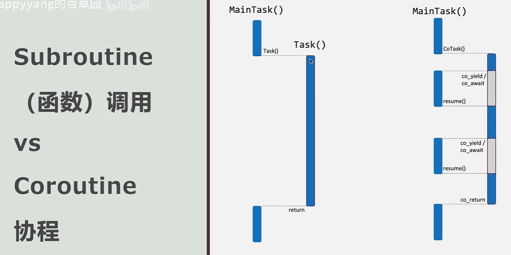

# C++ 协程学习

## 学习过程记录

1. [【\[C++\] 协程初步：手把手教你写一个协程】](https://www.bilibili.com/video/BV1c8411f7dw/?share_source=copy_web&vd_source=07d6eec55261917555a5d7fb4429cab9)

    20分钟的教程讲得非常清晰，适合入门。面向编译错误编程，逐步解决编译错误，最终实现一个猜数字游戏。

    完善版本的代码见 [projects/learn-cpp-coroutine/coroutine_basic.cpp](../projects/learn-cpp-coroutine/coroutine_basic.cpp)。

    视频中给协程画了一张图对比协程和普通函数：

    

2. [【\[C++\] 协程完结篇——实现思想】](https://www.bilibili.com/video/BV1U8411U7ud/?share_source=copy_web&vd_source=07d6eec55261917555a5d7fb4429cab9)

    基于[CppCon 2016: Gor Nishanov “C++ Coroutines: Under the covers"](https://www.youtube.com/watch?v=8C8NnE1Dg4A&t=8s)讲解了协程的底层实现原理，本质上就是一个状态机，在堆中存储运行过程所需的上下文，通过 `co_await`、`co_yield` 和 `co_return` 来控制状态的转移。

3. [【【协程革命】C++协程上手体验 干爽无废话 纯粹不卖课 全程字幕】](https://www.bilibili.com/video/BV1RV4y1L7ar/?share_source=copy_web&vd_source=07d6eec55261917555a5d7fb4429cab9)

    协程介绍，入门性质，主要是说未来是协程的。
