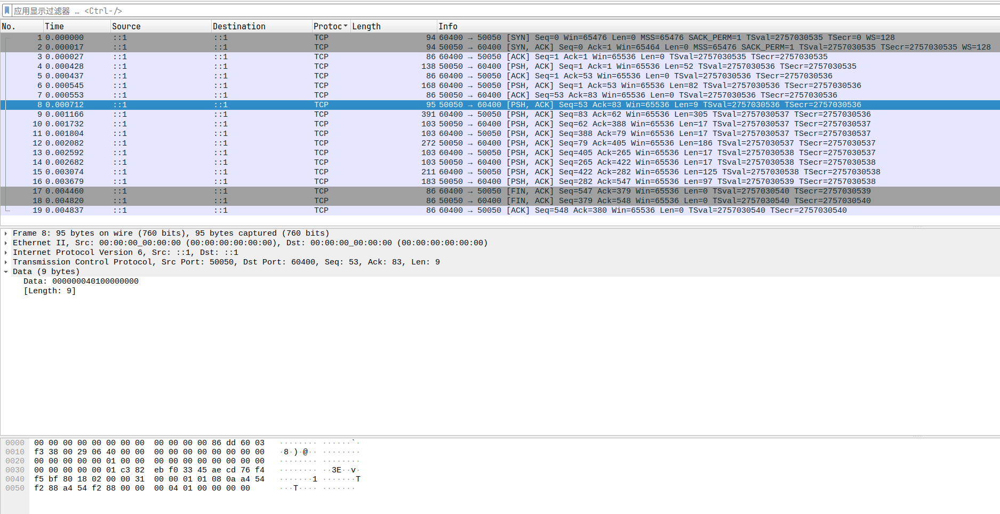
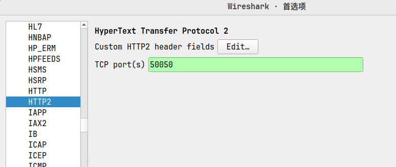
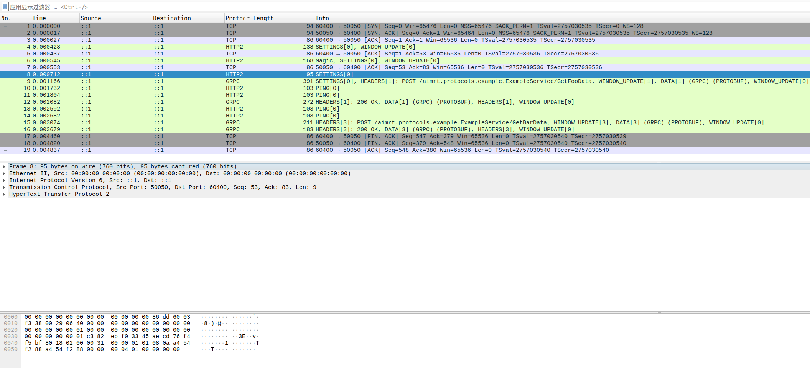

# RPC

## 参考资料

[用 C/C++实现游戏服务器，由于没有反射，服务器收到消息后该怎么快速地将消息转交给对应的处理函数呢？ - IcicleF 的回答 - 知乎](https://www.zhihu.com/question/636120604/answer/3345305152)

[grpcxx 开发日志](https://u-a.medium.com/list/devlog-grpcxx-ba1cd70b0c7d)

libs:

- [rpclib](https://github.com/rpclib/rpclib)：无需 IDL 的简洁 RPC 库
- [grpcxx](https://github.com/uatuko/grpcxx)：基于现代标准（C++20）实现的超高速 gRPC C++服务器
- [asio-grpc](https://github.com/Tradias/asio-grpc)：使用 Asio/统一执行器的异步 gRPC

## HTTP/2

[Getting Started With HTTP/2](https://dzone.com/articles/understanding-http2)

## 如何使用 Wireshark 分析 grpc 流量

1. 首先使用 tcpdump 抓取指定网卡（lo）上的指定端口（50050）的流量，并将其保存到文件中：

    ```bash
    sudo tcpdump -i lo port 50050 -w http2_50050_capture.pcap
    ```

2. 然后使用 Wireshark 打开该文件，当前仅仅显示到 TCP 协议，如下图：

    

3. 在 [编辑-首选项-协议-HTTP2 中设置端口号](https://isc.sans.edu/diary/HTTP2+Packet+Analysis+with+Wireshark/28986/) 为 50050，如下图：

    

4. 然后就可以看到 HTTP2 协议的数据包了，如下图：

    
