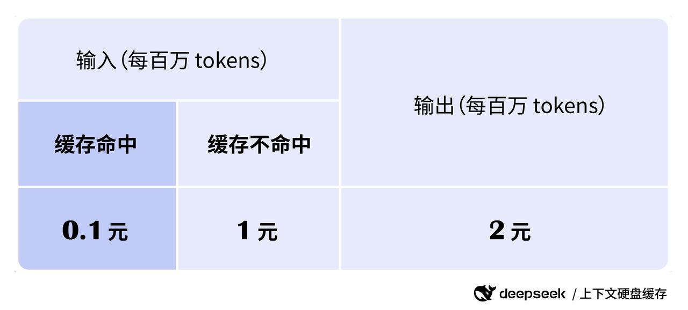
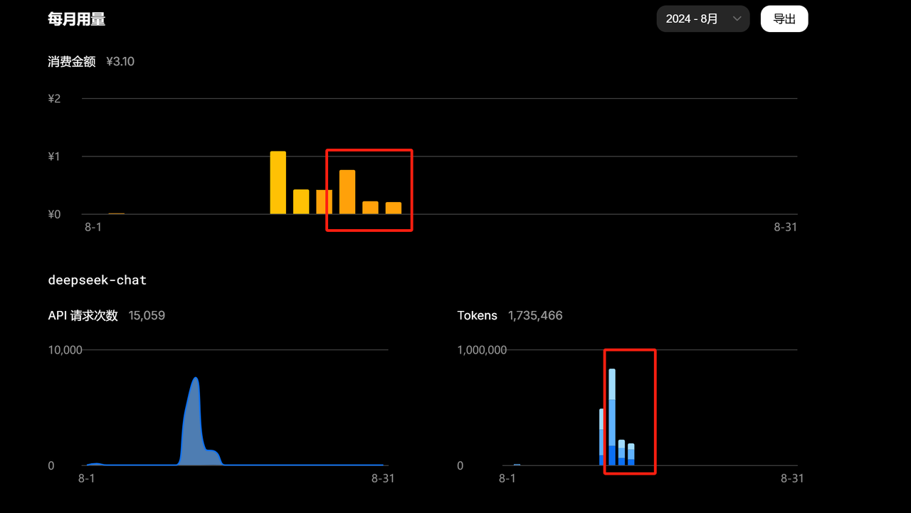
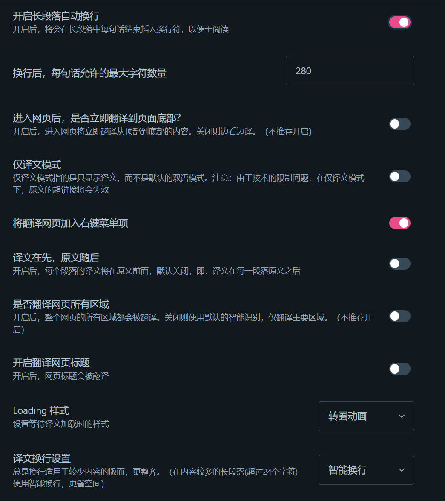

# 沉浸式翻译插件

- [沉浸式翻译插件](#沉浸式翻译插件)
  - [翻译服务推荐](#翻译服务推荐)
  - [Deepseek 翻译优缺点](#deepseek-翻译优缺点)
  - [Deepseek chat 翻译设置](#deepseek-chat-翻译设置)
  - [通用翻译设置](#通用翻译设置)
  - [翻译服务对比](#翻译服务对比)

官网链接： https://immersivetranslate.com/

个人认为最好用的网页翻译插件，具有网页翻译、视频字幕翻译、PDF 翻译、输入框翻译等功能，既可使用免费的谷歌翻译、微软翻译，也可以使各个平台大模型的 api 接口，同时支持手机、电脑多端使用。

推荐理由：优秀的双语对照能力，丰富的自定义设置，结合大模型的翻译能力，丝滑浏览英文网页、PDF等内容。

## 翻译服务推荐

翻译速度最快且不收费：
- 谷歌翻译

综合性价比较高：（花费极少数金钱获得大语言模型流畅的翻译能力）
- Deepseek chat
- OpenAI gpt-4o-mini

Deepseek chat 比 4o-mini 更便宜，而二者翻译效果相似，偶尔会搞出一点别扭的译文，含义准确，文字流畅，基本都可以满足日常网页浏览需求。

Deepseek chat 费用参考：

实际使用价格：

三天使用，分别对应
- 83W tokens，0.75 CNY
- 18W tokens，0.20 CNY

Deepseek api 的[超级低价](https://platform.deepseek.com/api-docs/zh-cn/pricing)结合其最新的[硬盘缓存策略](https://platform.deepseek.com/api-docs/zh-cn/news/news0802)，翻译服务中命中率接近 50%，价格击穿地心，日常使用仅需约 2~4 毛钱，高强度测试加使用也很难花超过 1 元，基本上是性价比天花板，开局送 10 块钱限时 1 个月的额度，正常使用根本不可能在限时内用完。

可供了解的翻译服务提供商：
- [豆包](https://www.volcengine.com/product/doubao)
  主力模型 Doubao-pro-32k 价格接近 deepseek（输入 0.8 CNY/M tokens，输出 2 CNY/M tokens），同时拥有50W 的免费额度，可以试用。
- [硅基流动 SiliconCloud](https://siliconflow.cn/zh-cn/siliconcloud)
  [无需API 即可免费使用 8 款大模型](https://mp.weixin.qq.com/s/qmsacA47MtpsWj3OYM7wtA)，都是 7-9B 的开源模型，注册还送14 CNY 额度。

## Deepseek 翻译优缺点
优点：
- 价格便宜，0.1 CNY 10W tokens，使用日均 0.3 元。
- 效果优秀，模型基础能力强，翻译自然流畅。

缺点：
- 翻译速度较慢
  有时网页首段较长的情况下需要约 5s 的等待，因此需要小心配置参数以免翻译速度太慢导致的糟糕体验
- 少数内容拒绝翻译（政治敏感等）
- 少数网页嵌入内容得不到翻译

总的来说，个人认为 Deepseek 性价比很高且 API 价格便宜无需翻墙或复杂手段可直接购买获取，是我目前首选的翻译服务提供商。

## Deepseek chat 翻译设置

参考以下配置文档

https://immersivetranslate.com/docs/services/ai/

https://platform.deepseek.com/api-docs/zh-cn/temperature

经过实际测试配置 deepseek chat 的翻译设置如下：
- 每秒最大请求数：20
  deepseek 并未对每秒请求数进行明确限制，仅说明[根据服务器负载动态调整](https://platform.deepseek.com/api-docs/zh-cn/faq#%E8%B0%83%E7%94%A8%E6%A8%A1%E5%9E%8B%E6%97%B6%E7%9A%84%E5%B9%B6%E5%8F%91%E9%99%90%E5%88%B6%E6%98%AF%E5%A4%9A%E5%B0%91%E6%98%AF%E5%90%A6%E5%8F%AF%E4%BB%A5%E6%8F%90%E9%AB%98%E8%B4%A6%E5%8F%B7%E7%9A%84%E5%B9%B6%E5%8F%91%E4%B8%8A%E9%99%90)，设置为 10 希望预加载尽可能多的段落提升阅读体验
- 每次请求最大文本长度：500
  字符数，非 token 数量，设置较小提高翻译速度
- 每次请求最大段落数：2
  为了得到更快的翻译速度，牺牲了多段落上下文可能带来的翻译质量提升
- Temperature：1.1

## 通用翻译设置

## 翻译服务对比
翻译速度：谷歌 >> gpt-4o-mini > deepseek chat （谷歌最快，几乎秒出，后面两者都有能够感受到的延迟，deepseek 偶尔会出现较长时间的等待）

翻译质量：gpt-4o-mini ≈ deepseek chat > 谷歌